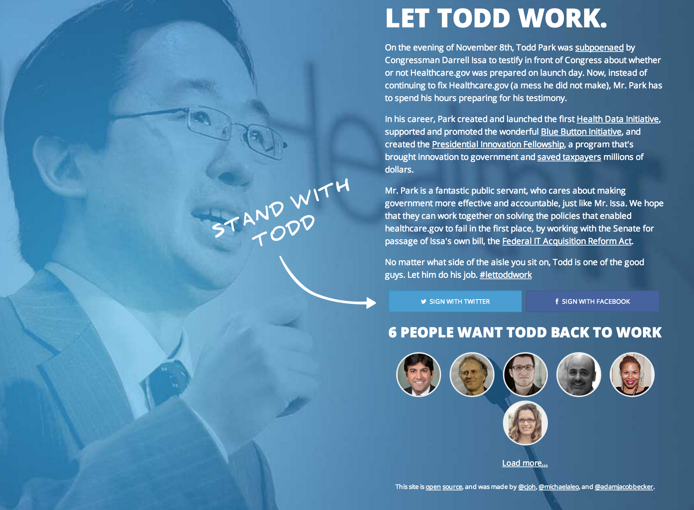

brunch-with-todd
=======================

A tasty combination of the [frontend](https://github.com/adamjacobbecker/stand-with-todd-frontend) and [backend](https://github.com/adamjacobbecker/stand-with-todd-backend) of [Let Todd Work](http://lettoddwork.org/) automated with [Brunch](http://brunch.io/). A simple application for collecting "signatures" via Twitter or Facebook that doesn't actually store any information beyond a user's social-network ID, name, and picture url.

To run in development
---------------------

> Make sure you have [foreman](https://github.com/ddollar/foreman) installed.

1. copy `.env.example` to `.env` and configure with proper environment variables
2. `$ foreman run npm start`

To make modifications
---------------------

All of the precompiled files like in the `app` folder. Make changes to the html within `app/assets/index.html`. Doing this while running `$ foreman run npm start` (which is equivalent to `brunch watch --server`) will automatically recompile changes.

To deploy on Heroku
-------------------

1. `heroku create STACKNAME`
2. `heroku addons:add mongohq`
3. `heroku config:set [all the environment variables]`
4. `git push heroku master`
